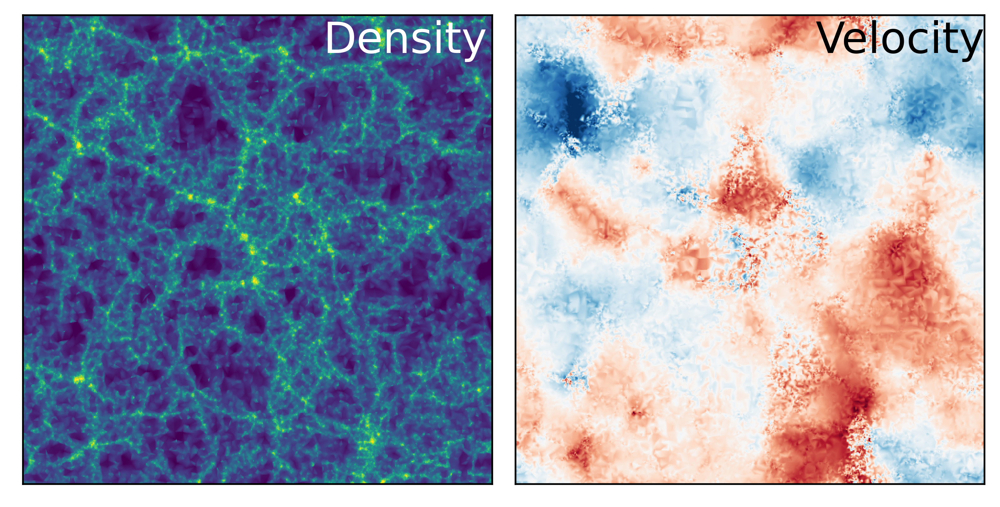

=====================================
Delaunay Tesselation Field Estimation
=====================================

The density and velocity field of a cosmological simulation computed with DTFE.

.. toctree::
  :maxdepth: 1

  tutorial_dtfe_2d
  tutorial_dtfe_3d
  tutorial_dtfe4grid