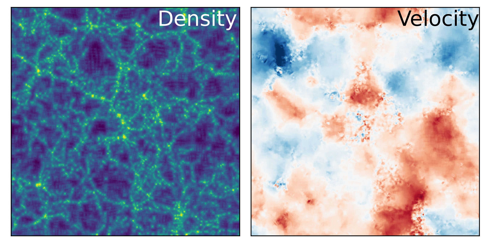

========
Grid SPH
========

The Grid-SPH method is a hybrid approach between traditional SPH and grid-based
density estimation. Instead of performing k-nearest neighbor searches, it
computes particle statistics on a grid and uses integral images to efficiently
approximate SPH-like smoothing. This approach is significantly faster for large 
datasets while maintaining reasonable accuracy.

The density and velocity field of a cosmological simulation computed with GridSPH.

gridSPH2D
=========

2D grid-based SPH density or field estimation.

Overview
--------

This method computes density or field estimates by:

1. Assigning particles to a grid using nearest-grid-point (NGP) assignment
2. Building an integral image for fast region summation
3. Estimating SPH-like volumes using enclosed particle counts
4. Converting volume estimates into density or field values

Example
-------

.. code-block:: python

    import fiesta

    boxsize = 100
    ngrid = 256
    rho = fiesta.gridsph.gridSPH2D(x, y, boxsize, ngrid, minpart=5)

    temp = fiesta.gridsph.gridSPH2D(x, y, [100, 100], 128, f=temperature, minpart=10)

gridSPH3D
=========

3D extension of the Grid-SPH method.

Overview
--------

This function extends the 2D grid-SPH algorithm into three dimensions,
using 3D integral images for fast volume estimation.

Example
-------

.. code-block:: python

    import fiesta

    boxsize = 100
    ngrid = 256
    rho = fiesta.gridsph.gridSPH3D(x, y, z, boxsize, ngrid, minpart=10)

    temp = fiesta.gridsph.gridSPH3D(x, y, z, [200, 200, 200], 64, f=temperature, minpart=20)

API Reference
=============

.. autofunction:: fiesta.gridsph.gridSPH2D
    :no-index:

.. autofunction:: fiesta.gridsph.gridSPH3D
    :no-index: