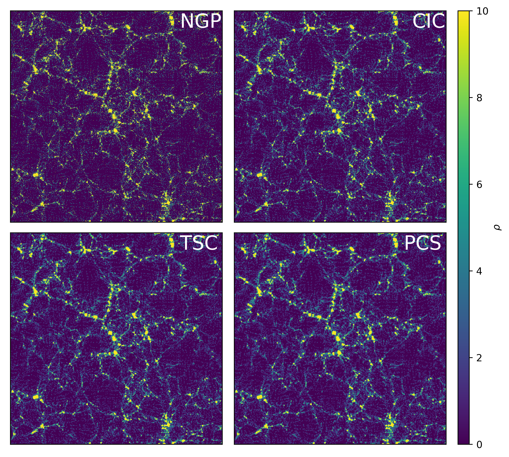
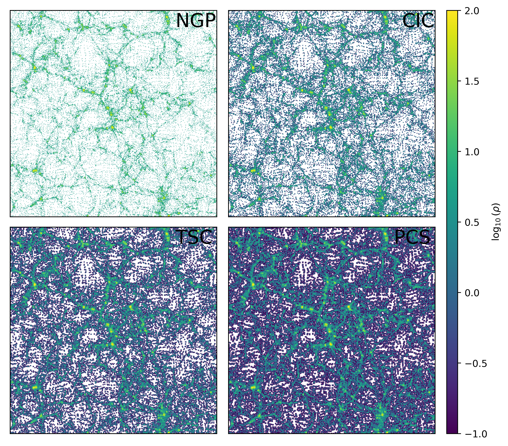

================
Particle to Grid
================

Overview
========

The particle-to-grid routines assign particle quantities onto regular
Cartesian meshes using standard particle-mesh interpolation schemes.

Supported assignment methods:

- ``NGP`` : Nearest Grid Point
- ``CIC`` : Cloud-In-Cell
- ``TSC`` : Triangular Shaped Cloud
- ``PCS`` : Piecewise Cubic Spline

The density field of a cosmological simulation computed with particle-to-grid
methods.

.. raw:: html

  

.. raw:: html

  

The log-density of the same density field.

.. raw:: html

  

.. raw:: html

  

Example: 2D Grid Assignment Densities
=====================================

.. code-block:: python

   import numpy as np
   import fiesta

   np.random.seed(0)

   x = np.random.uniform(0, 1, 10000)
   y = np.random.uniform(0, 1, 10000)

   # f here represent particle weights/masses, we will assume they are all equal.
   f = np.ones_like(x)

   dgrid = fiesta.part2grid2D(
       x, y, f,
       boxsize=1.0,
       ngrid=256,
       method='CIC'
   )

Example: 2D Grid Assignment Fields
==================================

.. code-block:: python

   import numpy as np
   import fiesta

   np.random.seed(0)

   x = np.random.uniform(0, 1, 10000)
   y = np.random.uniform(0, 1, 10000)

   # f here represent particle weights/masses, we will assume they are all equal.
   f = np.ones_like(x)

   dgrid = fiesta.part2grid2D(
       x, y, f,
       boxsize=1.0,
       ngrid=256,
       method='CIC'
   )

   # Let's assume we have velocities and we want to compute the velocity field.
   v = np.random.uniform(x)

   vgrid = fiesta.part2grid2D(
       x, y, v,
       boxsize=1.0,
       ngrid=256,
       method='CIC'
   )

   # vgrid is a momentum field since it weights the grid by the number of points 
   # so we must normalise to get the correct field values.

   vgrid /= dgrid

Example: 3D Grid Assignment Densities
=====================================

.. code-block:: python

   import numpy as np
   import fiesta

   np.random.seed(0)

   x = np.random.uniform(0, 1, 10000)
   y = np.random.uniform(0, 1, 10000)
   z = np.random.uniform(0, 1, 10000)

   # f here represent particle weights/masses, we will assume they are all equal.
   f = np.ones_like(x)

   dgrid = fiesta.part2grid3D(
       x, y, z, f,
       boxsize=1.0,
       ngrid=256,
       method='TSC'
   )

Example: 3D Grid Assignment Fields
==================================

.. code-block:: python

   import numpy as np
   import fiesta

   np.random.seed(0)

   x = np.random.uniform(0, 1, 10000)
   y = np.random.uniform(0, 1, 10000)
   z = np.random.uniform(0, 1, 10000)

   # f here represent particle weights/masses, we will assume they are all equal.
   f = np.ones_like(x)

   dgrid = fiesta.part2grid3D(
       x, y, z, f,
       boxsize=1.0,
       ngrid=256,
       method='TSC'
   )

   # Let's assume we have velocities and we want to compute the velocity field.
   v = np.random.uniform(x)

   vgrid = fiesta.part2grid3D(
       x, y, z, v,
       boxsize=1.0,
       ngrid=256,
       method='TSC'
   )

   # vgrid is a momentum field since it weights the grid by the number of points 
   # so we must normalise to get the correct field values.

   vgrid /= dgrid

API Reference
=============

.. autofunction:: fiesta.p2g.part2grid2D
    :no-index:

.. autofunction:: fiesta.p2g.part2grid3D
    :no-index: