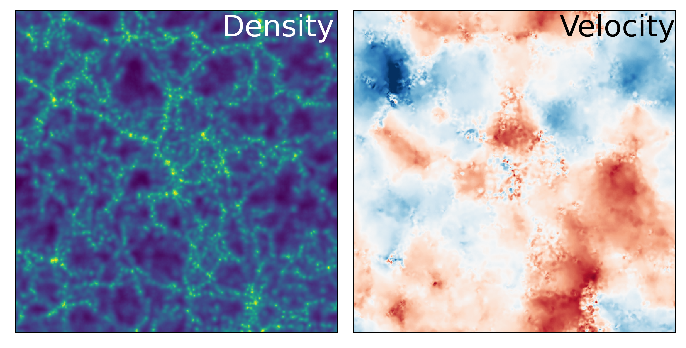

=============================
Smooth Particle Hydrodynamics
=============================

The density and velocity field of a cosmological simulation computed with SPH.

In-depth tutorials:

.. toctree::
  :maxdepth: 1

  tutorial_sph_class
  tutorial_sph_grid